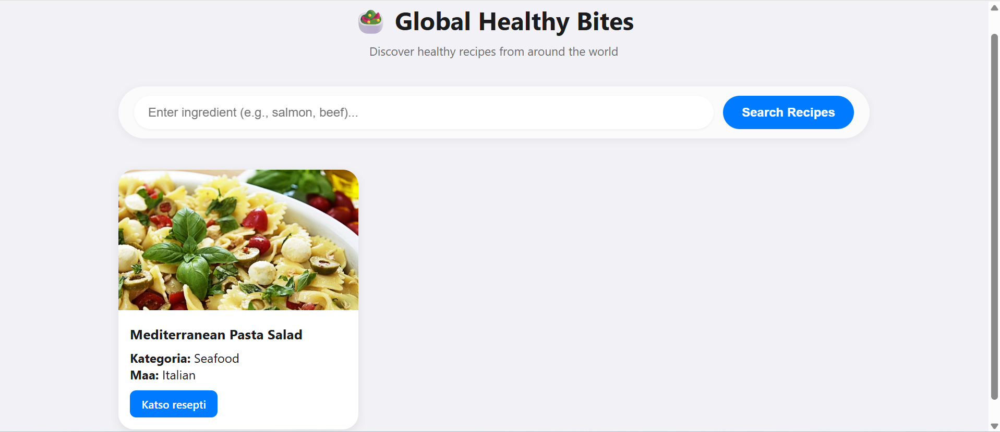
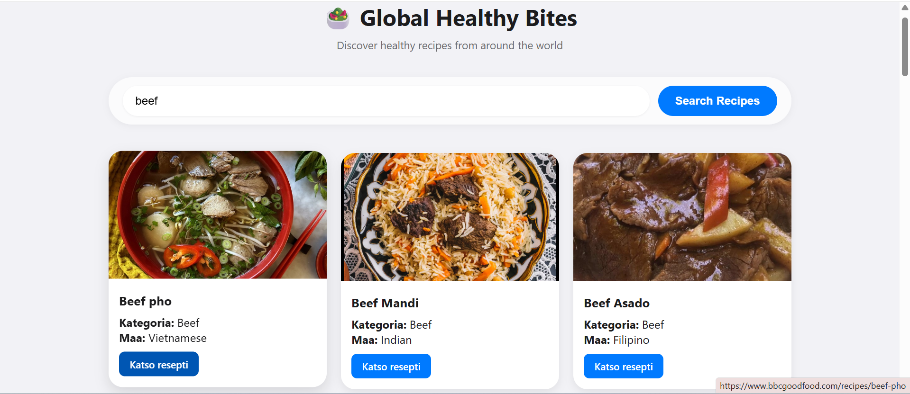

# Global Healthy Bites - Recipe Finder
**Author:** Sofiya Sakhchinskaya

## Verkkolinkit:
Pääset julkaistuun sovellukseen käsiksi osoitteessa: [https://globalrecipefinder.netlify.app/](https://globalrecipefinder.netlify.app/)

## Työn jakautuminen 
Tein projektin itsenäisesti. Vastasin sovelluksen kokonaisvaltaisesta suunnittelusta, HTML-rakenteen luomisesta, CSS-tyylittelystä sekä JavaScript-logiikan ja API-integraation toteuttamisesta.

## Oma arvio työstä ja oman osaamisen kehittymisestä
Mielestäni onnistuin projektissa kokonaisuutena hyvin. Vaikka sovelluksesta tuli rakenteeltaan simppeli, panostin erityisesti CSS-tyylien hiomiseen ja Fetch-toiminnallisuuden varmuuteen. Sovellus on selkeäkäyttöinen ja visuaalisesti miellyttävä.

Parantamista olisi voinut olla CSS-tyylien syvällisemmässä kokeilussa ja monimutkaisemman asettelun luomisessa, mutta tavoitteenani oli pitää käyttöliittymä puhtaana ja toimivana.

Koen, että suurin ja tärkein oppimiskokemus oli API-yhteyden muodostaminen ja ulkoisen datan tuominen osaksi omaa sovellusta. Opin myös:
- Käsittelemään asynkronista koodia (async/await).
- Muokkaamaan HTML-dokumenttia dynaamisesti (DOM-manipulaatio) saatujen hakutulosten perusteella.
- Toteuttamaan virheidenhallinnan (try/catch), jotta sovellus ei kaadu, vaikka haku epäonnistuisi.

Antaisin itselleni pisteitä seuraavasti: 10/10 p. Sovellus täyttää kaikki kurssin vaatimukset, on tyylitelty ja toimii teknisesti virheettömästi.

## Palaute opettajalle
Tämä projekti oli todella kiva ja opettavainen. Se antoi hyvän yleisen ja teknisen osaamisen erityisesti API-rajapintojen hyödyntämiseen web-kehityksessä.

---

## Sisällysluettelo:
- [Global Healthy Bites - Recipe Finder](#global-healthy-bites---recipe-finder)
  - [Verkkolinkit:](#verkkolinkit)
  - [Työn jakautuminen](#työn-jakautuminen)
  - [Oma arvio työstä ja oman osaamisen kehittymisestä](#oma-arvio-työstä-ja-oman-osaamisen-kehittymisestä)
  - [Palaute opettajalle](#palaute-opettajalle)
  - [Sisällysluettelo:](#sisällysluettelo)
  - [Tietoja sovelluksesta](#tietoja-sovelluksesta)
  - [Tunnetut virheet/bugit](#tunnetut-virheetbugit)
  - [Kuvakaappaukset](#kuvakaappaukset)
    - [Aloitusnäkymä](#aloitusnäkymä)
    - [Hakutulokset](#hakutulokset)
  - [Teknologiat](#teknologiat)
  - [Asennus](#asennus)
  - [Kiitokset](#kiitokset)
  - [Lisenssi](#lisenssi)

## Tietoja sovelluksesta
**Global Healthy Bites** on verkkosovellus, jonka avulla käyttäjät voivat etsiä reseptejä ja ruoka-inspiraatiota ympäri maailmaa. Sovellus hyödyntää TheMealDB-rajapintaa ja tarjoaa käyttäjälle hakutuloksina ruuan nimen, kuvan, kategorian sekä suoran linkin alkuperäiseen ohjeeseen.

## Tunnetut virheet/bugit
- Jotkut API-rajapinnan tarjoamat ulkoiset linkit (strSource) saattavat osoittaa vanhentuneille sivuille. Olen huomioinut tämän koodissa ja lisännyt varajärjestelmän, joka ohjaa käyttäjän tarvittaessa YouTube-videoon tai Google-hakuun.

## Kuvakaappaukset

### Aloitusnäkymä

### Hakutulokset

## Teknologiat
- **HTML5**: Rakenteen ja semanttisen sisällön määrittely.
- **CSS3**: Visuaalinen tyylittely, Glassmorphism-efektit ja responsiivinen Grid-asettelu.
- **JavaScript (ES6)**: Fetch API tiedonhakuun, dynaamiset tapahtumankäsittelijät (Event Listeners).
- **TheMealDB API**: Avoin REST API reseptidatalle.

## Asennus
1. Lataa tai kloonaa repositorio GitHubista.
2. Avaa `index.html` selaimellasi (esim. VS Code Live Serverillä).
3. Käytä hakukenttää löytääksesi reseptejä tietyllä raaka-aineella (esim. "Beef" tai "Pasta").

## Kiitokset
- [TheMealDB](https://www.themealdb.com/api.php) – Rajapinnan tarjoaja.
- **ChatGPT**: Käytetty tukena koodin optimoinnissa, virheiden selvittämisessä sekä dokumentaation hiomisessa. Tekoäly auttoi erityisesti selittämään monimutkaisia JavaScript-käsitteitä prosessin aikana.

## Lisenssi
MIT-lisenssi @ Sofiya Sakhchinskaya